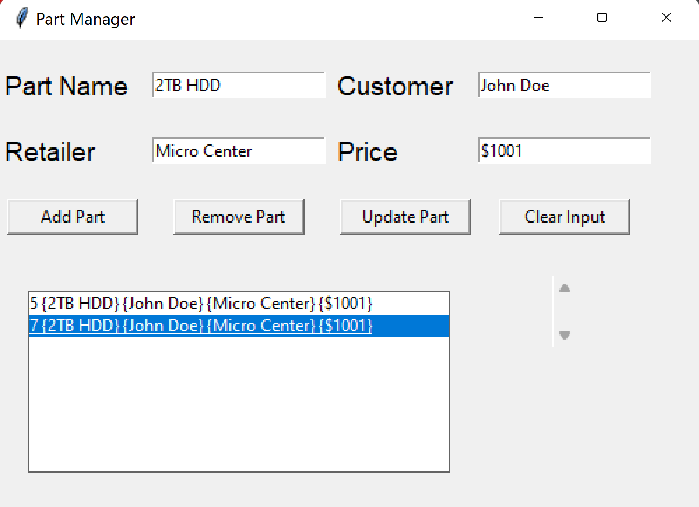

# Part Manager Application

This is a simple part manager application built with tkinter and sqlite3. It allows you to add, edit, and delete parts. 





### Install dependencies

```
Pip install pipenv
pipenv shell
Control+shif+p and select the new python interpeter
pipenv install tkinter
pipenv install pyinstaller
pipenv install messagebox
```

### Run application
```
python part_manager.py
```

